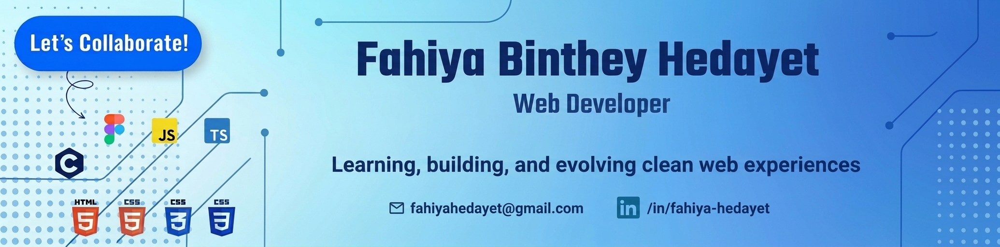

<!-- =========================================================
     Fahiya Binthey Hedayet
     GitHub Profile README
========================================================= -->

<!-- Banner -->

<p align="center">
  
</p>

<br>

<!-- Intro -->

<div align="center">

# Hi, I'm Fahiya 👋

### Frontend Developer · Continuous Learner · Problem Solver

<p>
  <i>Turning ideas into meaningful digital experiences, one line of code at a time.</i>
</p>

<br>

<a href="mailto:fahiyahedayet@gmail.com">  </a> &nbsp; <a href="https://www.linkedin.com/in/fahiya-hedayet-b1542a2b2/">  </a> &nbsp; <a href="https://github.com/fahiyahedayet">  </a> <br><br>  </div>

---

<!-- About Me -->

## 🌷 About Me

Hi! I'm **Fahiya Binthey Hedayet**, a passionate **Frontend Developer from Bangladesh** who enjoys creating clean, practical, and user-friendly web experiences.

I enjoy understanding **how things work under the hood**, solving problems, and continuously improving the way I approach development.

Currently, I'm expanding my skills from frontend development toward **Full-Stack Web Development** while strengthening my JavaScript and TypeScript fundamentals.

<br>

<div align="center">

| 🧩 Problem Solver | 🌱 Continuous Learner | 🔍 Curious Mind |
|:---:|:---:|:---:|
| Breaking problems into smaller pieces | Always learning something new | Understanding how things work |

</div>

<br>

---

<!-- Tech Stack -->

## 🛠️ Tech Stack

### 💻 Languages

<p>
  
</p>

### 🎨 Frontend & Design

<p>
  
</p>

### 🗄️ Database

<p>
  
</p>

<br>

---

<!-- Currently Learning -->

## 🌱 Currently Learning

<div align="center">

| Technology | Learning Focus |
|:---:|:---|
| ⚡ **JavaScript** | Modern JavaScript & ES6+ |
| 🔷 **TypeScript** | Strongly typed JavaScript |
| 🌐 **Full-Stack Development** | Expanding beyond the frontend |
| 🧠 **Problem Solving** | Better logic & cleaner solutions |

</div>

<br>

<div align="center">

**Learn** → **Build** → **Break** → **Fix** → **Improve** → **Grow** 🚀

</div>

<br>

---

<!-- Development Journey -->

## 🎯 My Development Journey

<div align="center">

```text
HTML & CSS
     ↓
JavaScript
     ↓
ES6+
     ↓
TypeScript
     ↓
Frontend Development
     ↓
Full-Stack Development
     ↓
Building meaningful projects 🚀

</div>

I'm focused on turning what I learn into real projects and practical experience.

<br>

<!-- GitHub Statistics -->
📊 GitHub Statistics
<div align="center">

<br>

 <br>
<!-- Quote -->
💭 A Thought I Keep Close
<div align="center">
✨

"The secret of getting ahead is getting started."

— Mark Twain

<br>

learn → build → break → fix → repeat → grow

</div> <br>
<!-- Connect --> <div align="center">
✨ Thanks for stopping by!
Let's build, learn, and grow together. 🚀
<br> <a href="mailto:fahiyahedayet@gmail.com">  </a>

<br><br>

<a href="https://github.com/fahiyahedayet">  </a> </div>

<br><br>

<!-- Footer --> <div align="center">

 ```
