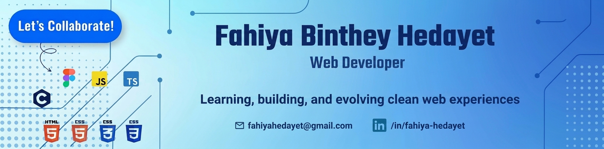

<!-- =========================================================
     Fahiya Binthey Hedayet
     GitHub Profile README
========================================================= -->

<!-- Banner -->

  

 

<!-- ======================= INTRO ======================= -->

  

Hi, I'm Fahiya 👋
Frontend Developer · Problem Solver · Continuous Learner

 <i>Turning ideas into meaningful digital experiences,  one line of code at a time.</i> 

 

📍 Chittagong , Bangladesh

  

 &nbsp;  &nbsp; 

  

 

<!-- ======================= ABOUT ======================= -->

🌷 About Me

Hi! I'm Fahiya Binthey Hedayet, a Frontend Developer from Bangladesh who enjoys creating clean, practical, and user-friendly web experiences.

I'm curious about what happens behind the interface — not just how something looks, but why it works the way it does.

Currently, I'm expanding my skills toward Full-Stack Web Development while strengthening my foundations in JavaScript, TypeScript, React and modern web technologies.

 

🧩 Problem Solver	🌱 Continuous Learner	🔍 Curious Mind
Break problems into smaller pieces	Learn by building	Understand how things work

 

<!-- ======================= CURRENTLY ======================= -->

🚀 What I'm Doing Now

 

Learning → Building → Breaking → Fixing → Improving

<!-- ======================= TECH STACK ======================= -->

🛠️ Tech Stack

💻 Languages

  

🎨 Frontend & Design

  

🗄️ Database

  

🔧 Tools & Workflow

  

 

<!-- ======================= LEARNING ======================= -->

🌱 Currently Learning

<table> <tr> <td align="center" width="50%">

⚡ JavaScript

Modern JavaScript, ES6+, 
problem solving & clean logic

</td>

<td align="center" width="50%">

🔷 TypeScript

Types, interfaces, 
safer and maintainable code

</td> </tr>

<tr> <td align="center">

⚛️ React & Next.js

Components, state, 
routing & modern frontend

</td>

<td align="center">

🌐 Full-Stack

Expanding beyond frontend 
and understanding the complete web

</td> </tr> </table>

<!-- ======================= JOURNEY ======================= -->

🧭 My Development Journey

HTML & CSS
     ↓
JavaScript
     ↓
React
     ↓
TypeScript
     ↓
Next.js
     ↓
Full-Stack Development
     ↓
Building Useful Things 🚀

 <i>I'm not trying to learn everything at once.  I'm focusing on understanding the fundamentals and building with them.</i> 

<!-- ======================= GITHUB STATS ======================= -->

📊 GitHub at a Glance

 

 

<!-- ======================= CONTRIBUTIONS ======================= -->

🐍 My GitHub Journey

<!-- ======================= PHILOSOPHY ======================= -->

💭 A Thought I Keep Close

"The secret of getting ahead is getting started."
— Mark Twain

 

learn → build → break → fix → repeat → grow 🚀

 

<!-- ======================= CONNECT ======================= -->

🤝 Let's Connect

<i>I'm always interested in learning, building, and connecting with people who love technology.</i>

  

 

  

<!-- ======================= FOOTER ======================= -->

  

